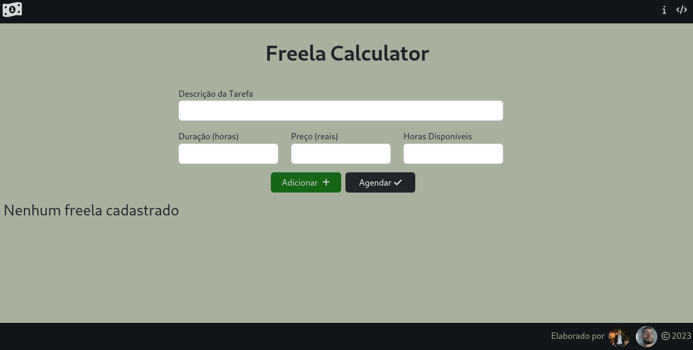
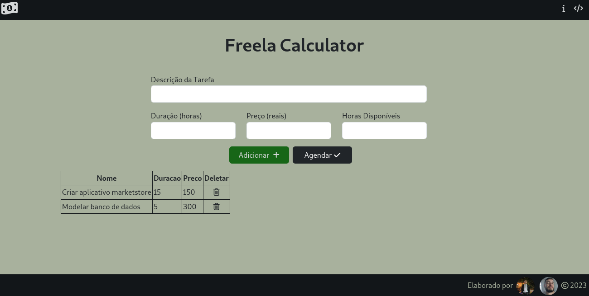
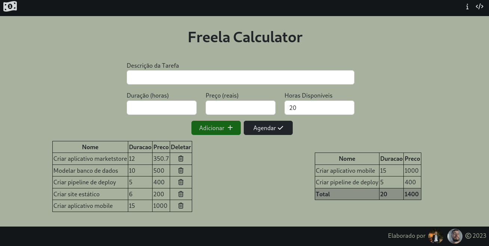

# Freela Calculator

**Número da Lista**: Dupla 06 (T01)<br>
**Conteúdo da Disciplina**: Programação Dinâmica<br>

## Alunos

| Matrícula  | Aluno                                                                   |
| ---------- | ----------------------------------------------------------------------- |
| 19/0112123 | [Lucas Gabriel Sousa Carmargo Paiva](https://github.com/lucasgabriel-2) |
| 20/0042327 | [Nicolas Chagas Souza](https://github.com/nszchagas)                    |

## Sobre

Esse projeto consiste em um seletor de trabalhos freelance a partir de seus pesos (valor recebido). Para tal, foi utilizado o algoritmo **knapsack** com pesos.

## Screenshots

### Tela Inicial



### Listagem das Tarefas Inseridas



### Após Seleção das Tarefas



## Instalação

**Linguagem**: Javascript <br/>
**Framework**: Nenhum <br/>

O projeto está disponível no [github pages](https://projeto-de-algoritmos.github.io/PD_FreelaCalculator/), mas caso queira rodá-lo na sua máquina, basta seguir os passos a seguir.

Para rodar o projeto em um servidor local basta instalar o pacote `live-server` do node e executar o script `start` do [package.json](./package.json) na raiz do projeto:

```shell
npm install
npm start
```

## Uso

Para usar o projeto, acesse a página ([local](http://localhost:8080) ou no [github](https://projeto-de-algoritmos.github.io/PD_FreelaCalculator/)), adicione as tarefas com suas durações e valores, e a quantidade de horas disponível. Em seguida, clique em agendar e verifique quais tarefas deve fazer para receber o maior valor possível.

## Apresentação

[Arquivo de apresentação](./assets/gravacao.mp4)
